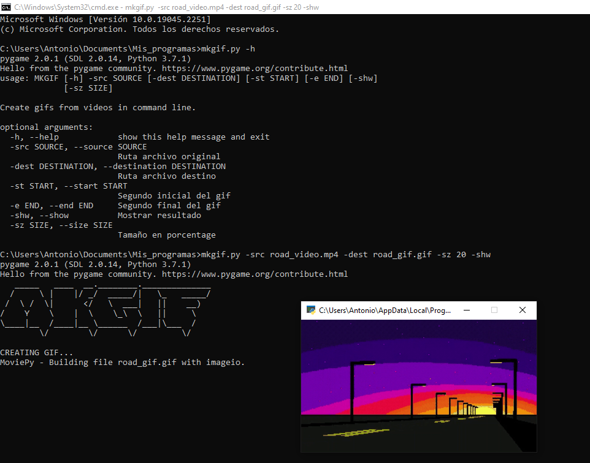
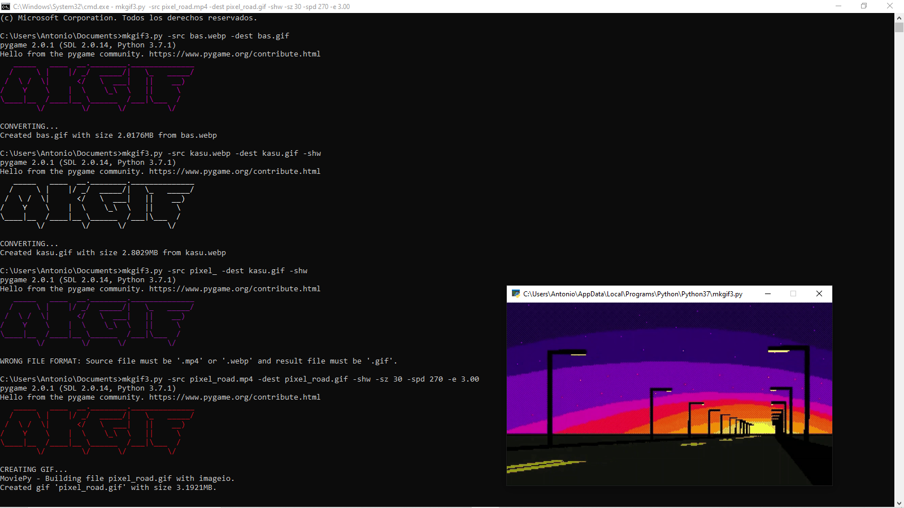

# MKGIF
Create gifs from videos in command line.

------------------------------
## MKGIF - Video & WebP to GIF Converter
Una herramienta de línea de comandos (CLI) potente, eficiente y personalizable escrita en Python para convertir videos y archivos WebP animados en GIFs optimizados. Cuenta con barras de progreso interactivas, personalización de tamaño/velocidad y la capacidad de cancelar el proceso en tiempo real.
## Características

* Compatibilidad amplia: Soporta formatos .mp4, .avi, .mov, .wmv, .rm, .gif y .webp.
* Control de rendimiento: Procesamiento eficiente de fotogramas mediante generadores para moderar el uso de memoria RAM.
* Cancelación en vivo: Presiona la Barra Espaciadora en cualquier momento para abortar la conversión de manera segura.
* Personalización total: Ajusta la velocidad (speed), escala de resolución (size) y rango de fotogramas (from_frame / to_frame).
* Interfaz colorida: Salida estilizada en la terminal usando arte ASCII y colores dinámicos.

------------------------------
## Requisitos Previos
El script utiliza las siguientes librerías de Python. Asegúrate de tenerlas instaladas antes de ejecutarlo:

pip install opencv-python pillow numpy tqdm colorama pynput pyfiglet pyglet

------------------------------
## Uso Básicos
El script se ejecuta desde la terminal pasando los argumentos necesarios.

python mkgif.py --source video.mp4 --destination resultado.gif [opciones]

## Argumentos Disponibles (Ejemplo de configuración)

* --source: Ruta del video o archivo WebP de origen (Obligatorio).
* --destination: Ruta y nombre del archivo .gif de salida (Obligatorio).
* --size: Porcentaje de escalado de la imagen (Ej: 50 para reducir a la mitad).
* --speed: Porcentaje de velocidad del GIF (Ej: 200 para doble de velocidad).
* --from_frame: Fotograma inicial desde el que empezar a capturar.
* --to_frame: Fotograma final donde detener la captura.
* --optimize: Aplica optimización de paleta y compresión de Pillow al guardar.

------------------------------
## Estructura del Código
El script está diseñado modularmente bajo las siguientes funciones clave:

* AppState: Dataclass que gestiona el estado global de la aplicación y la detención por teclado.
* read_video(): Extrae los fotogramas del archivo multimedia de origen de forma eficiente.
* frame_generator(): Generador intermedio que entrega fotogramas uno a uno para evitar saturar la memoria.
* create_gif(): Redimensiona, procesa la barra de progreso y exporta el archivo GIF final.
* on_press(): Escucha en segundo plano la tecla espacio mediante pynput para detener los bucles de manera asíncrona.

------------------------------
## Licencia
Este proyecto está bajo la licencia MIT. Siéntete libre de clonarlo, modificarlo y mejorar el código.
------------------------------

ARGUMENTS:
-src/--source: Nombre del vídeo original (obligatorio).
-dest/--destination: Nombre del archivo a generar (opcional).
-sz/--size: Tamaño en porcentaje del gif respecto al vídeo original (opcional).
-shw/--show: Muestra resultado en ventana emergente al finalizar el proceso de generado (opcional).
-st/--start: Segundo inicial para gif (opcional).
-e/--end: Segundo final (opcional).
-spd/--speed: Velocidad relativa de la animación (opcional)

