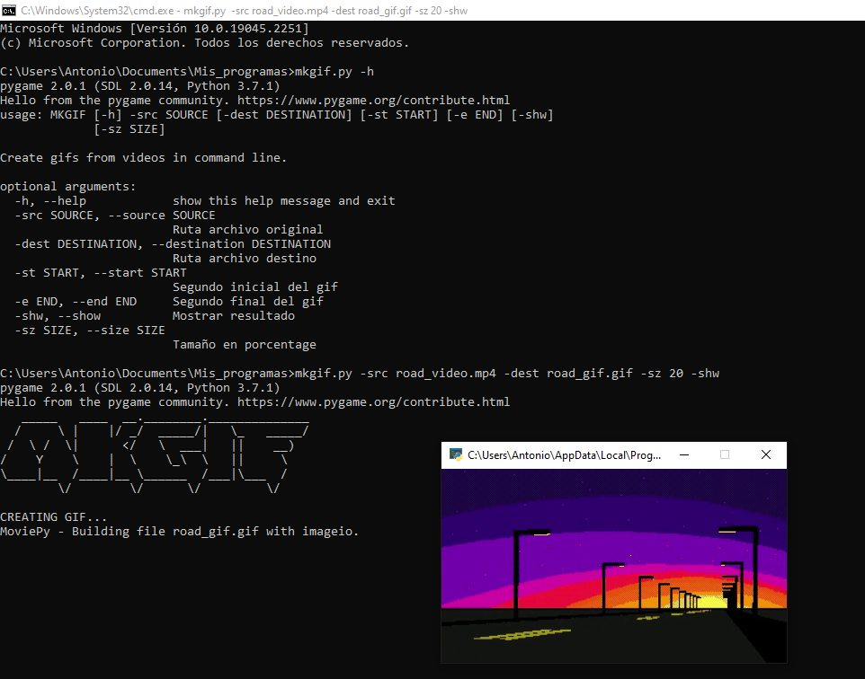

# MKGIF
Create gifs from videos in command line.

ARGUMENTS:
-src/--source: Nombre del vídeo original (obligatorio).
-dest/--destination: Nombre del archivo a generar (opcional).
-sz/--size: Tamaño en porcentaje del gif respecto al vídeo original (opcional).
-shw/--show: Muestra resultado en ventana emergente al finalizar el proceso de generado (opcional).
-st/--start: Segundo inicial para gif (opcional).
-e/--end: Segundo final (opcional).
-spd/--speed: Velocidad relativa de la animación (opcional)

